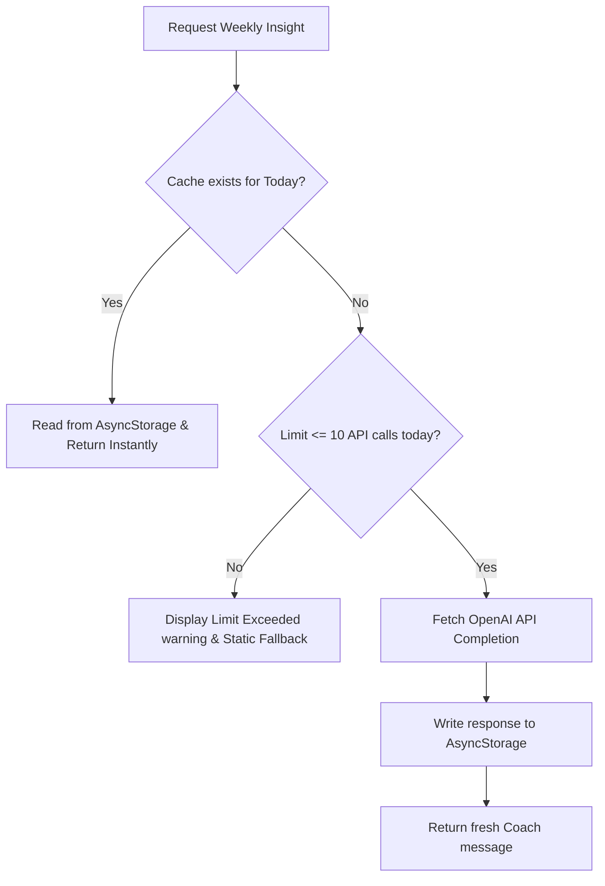
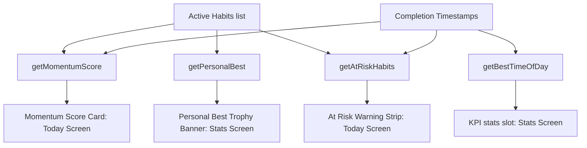

# StreakUp AI Habit Coach & Insights Engine Guide

This guide details the integration details, caching systems, prompt layouts, and privacy controls implemented to build the AI Habit Coach and local insights in **StreakUp**.

---

## 1. AI request lifecycle with caching

To minimize API subscription costs and latency, StreakUp caches daily Weekly Insights locally.



---

## 2. Insights Engine Computation Graph

Local calculations process data metrics on-device with zero network latency.



---

## 3. Prompt Engineering Decisions

Each coach operation uses structured prompt templates to ensure clean, JSON-parsable returns:

- **generateHabitSuggestions**:
  - *Prompt*: `"Generate 5 starter habits for a user whose goal is '{goal}'... Respond strictly with a JSON array of objects having name, emoji, color."`
  - *Rationale*: Forcing the model to output *only* raw JSON avoids header explanations or markdown wrappers, reducing tokens and simplifying frontend JSON parsing.
- **analyzeWeakDay**:
  - *Prompt*: `"Analyze this checklist history date list: [...]. Find which day of the week shows the lowest consistency or completion gaps, and explain how they can overcome this struggle."`
  - *Rationale*: Feeding raw date arrays allows the LLM to identify weekday patterns without revealing custom user names.

---

## 4. Rate Limiting Strategy

StreakUp implements local client-side rate limits of **10 requests per user per day**.
- Today's date string is verified on each coach action.
- If the date matches, the count increments.
- If the count exceeds 10, the action is blocked, displaying a warning message and using the static fallbacks.
- This ensures developers are protected against accidental API loops, preventing surprise bills.

---

## 5. How to Swap OpenAI for a Local LLM (Ollama)

If you wish to deploy a self-hosted or local LLM (e.g. Llama-3) to avoid OpenAI subscription costs:

1. **Install Ollama** on your computer/server (https://ollama.com).
2. **Run the model**:
   ```bash
   ollama run llama3
   ```
3. **Modify `lib/aiCoach.ts`**:
   Replace the fetch destination URL from `https://api.openai.com/v1/chat/completions` to your local Ollama address (usually `http://localhost:11434/v1/chat/completions` or machine IP):
   ```typescript
   const response = await fetch('http://YOUR_LOCAL_IP:11434/v1/chat/completions', {
     method: 'POST',
     headers: {
       'Content-Type': 'application/json'
     },
     body: JSON.stringify({
       model: 'llama3',
       messages: [
         { role: 'system', content: systemPrompt },
         { role: 'user', content: userPrompt }
       ],
       temperature: 0.7
     })
   });
   ```
This provides a free, private, and fully offline AI Habit Coach deployment!

---

## 6. Privacy & User Data Control

### Minimizing Data Shared
To preserve privacy, StreakUp *never* sends the user's password, email, private profile names, or geographic location to OpenAI.
The context payloads include only:
- General goal categories (e.g. "fitness" or "health").
- Raw completion dates lists (e.g. `['2026-07-15', '2026-07-16']`).
- General habit metrics (e.g. "User is tracking 4 habits. Average consistency: 75%").

This minimal dataset is completely anonymous and cannot be traced back to the user's real-world identity.
