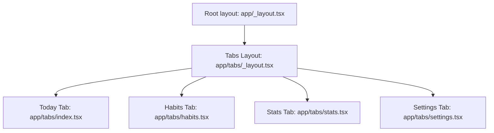
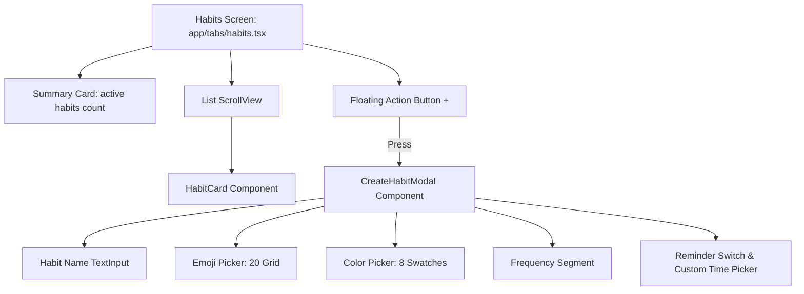

# StreakUp — Habit and Fitness Tracker

StreakUp is a premium, high-aesthetic React Native application designed to help users track their habits, schedule workouts, monitor progress, and build streaks. Built using Expo TypeScript, Firebase (Auth + Firestore), and React Native Reanimated.

---

## App Concept & Features

StreakUp leverages gamification to keep users engaged and motivated:
- **Streak Multipliers**: Build consecutive days of completed habits to multiply your visual status level.
- **Fitness Tracking**: Record workouts (duration, calories, distance) and pair them with active habits.
- **Aesthetic Visualizations**: Dynamic progress charts and rich, custom dark mode styling with glassmorphism touches.
- **Real-time Sync**: Synced securely via Firebase Auth and Firestore with offline-first support.

---

## Navigation Structure



---

## Habits Screen Component Structure



---

## Cloud Firestore Data Model Structure

```mermaid
graph TD
    usersCol[users Collection] --> userDoc[User Document: uid]
    userDoc --> habitsSub[habits Subcollection]
    userDoc --> completionsSub[completions Subcollection]
    
    habitsSub --> habitDoc[Habit Document: habitId]
    habitDoc --> hId[id: string]
    habitDoc --> hName[name: string]
    habitDoc --> hEmoji[emoji: string]
    habitDoc --> hColor[color: string]
    habitDoc --> hFreq[frequency: string]
    habitDoc --> hRemind[reminderTime: string | null]
    habitDoc --> hCreated[createdAt: string]
    habitDoc --> hStreak[streak: number]
    habitDoc --> hCompletions[completions: string[] -- cached dates]
    
    completionsSub --> compDateDoc[Date Document: YYYY-MM-DD]
    compDateDoc --> habitsSub2[habits Subcollection]
    habitsSub2 --> compHabitDoc[Completed Habit Document: habitId]
    compHabitDoc --> completedAt[completedAt: string]
```

---

## Setup Prerequisites

To run this app locally:
1. **Node.js**: Make sure Node.js (v18+) is installed.
2. **Expo Go**: Install the Expo Go app on your iOS or Android physical device, or set up an emulator.
3. **Firebase Project**:
   - Create a Firebase project in the [Firebase Console](https://console.firebase.google.com/).
   - Enable **Authentication** (Email/Password) and **Cloud Firestore**.
   - Create a Web App configuration to get your Firebase credentials.
4. **Environment Variables**:
   - Copy `.env.example` to `.env` in the root directory.
   - Replace the placeholder credentials with your actual Firebase Web Config values.
5. **React Native Reanimated Setup**:
   - Reanimated is pre-installed. If rebuilding from scratch, ensure `react-native-reanimated/plugin` is configured in your babel plugins array, and clear your bundler cache with `npx expo start --clear` if worklet compilation warnings arise.

### Installation & Launching

```bash
# Install dependencies
npm install

# Start the Expo development server
npm run start
```
