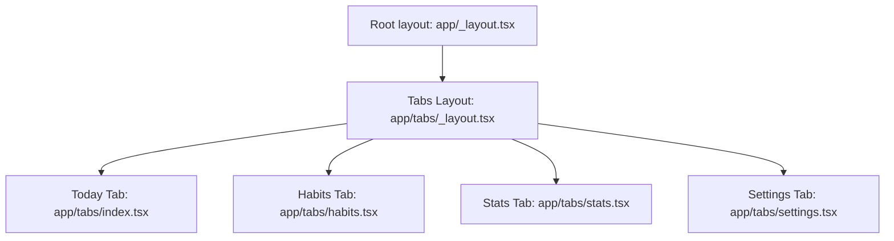
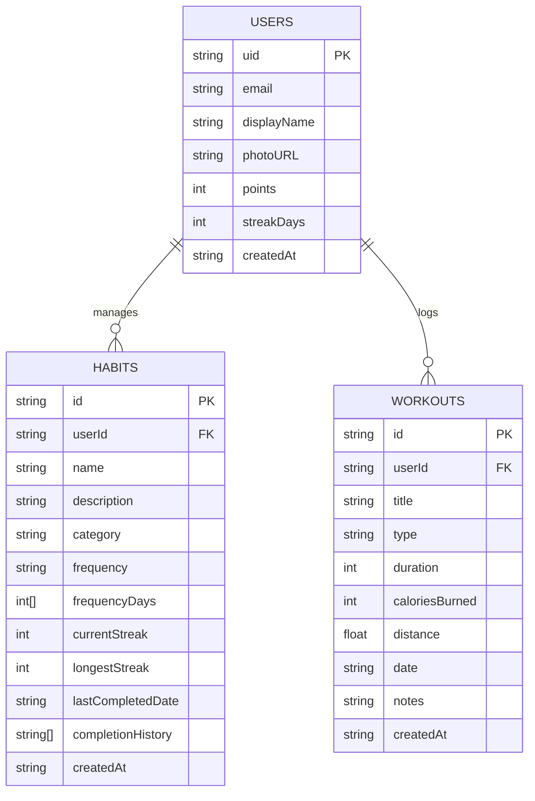

# StreakUp — Habit and Fitness Tracker

StreakUp is a premium, high-aesthetic React Native application designed to help users track their habits, schedule workouts, monitor progress, and build streaks. Built using Expo TypeScript, Firebase (Auth + Firestore), and React Native Reanimated.

---

## App Concept & Features

StreakUp leverages gamification to keep users engaged and motivated:
- **Streak Multipliers**: Build consecutive days of completed habits to multiply your visual status level.
- **Fitness Tracking**: Record workouts (duration, calories, distance) and pair them with active habits.
- **Aesthetic Visualizations**: Dynamic progress charts and rich, custom dark mode styling with glassmorphism touches.
- **Real-time Sync**: Synced securely via Firebase Auth and Firestore with offline-first support.

---

## Navigation Structure



---

## Planned Firebase Data Model



---

## Setup Prerequisites

To run this app locally:
1. **Node.js**: Make sure Node.js (v18+) is installed.
2. **Expo Go**: Install the Expo Go app on your iOS or Android physical device, or set up an emulator.
3. **Firebase Project**:
   - Create a Firebase project in the [Firebase Console](https://console.firebase.google.com/).
   - Enable **Authentication** (Email/Password) and **Cloud Firestore**.
   - Create a Web App configuration to get your Firebase credentials.
4. **Environment Variables**:
   - Copy `.env.example` to `.env` in the root directory.
   - Replace the placeholder credentials with your actual Firebase Web Config values.

### Installation & Launching

```bash
# Install dependencies
npm install

# Start the Expo development server
npm run start
```
