<p align="left">
  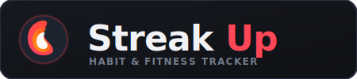
</p>

StreakUp is a premium, high-aesthetic React Native application designed to help users track their habits, schedule workouts, monitor progress, and build streaks. Built using Expo TypeScript, Firebase (Auth + Firestore), and React Native Reanimated.


### 📱 Direct Android APK Download

Scan this QR code on your Android device to download and install the APK directly:

<p align="center">
  
  <br/>
  <a href="https://expo.dev/accounts/kpebble/projects/streakup/builds/1e05632e-cc34-45a0-b3fc-33418398e7d6">Direct Link to Download APK</a>
</p>


<table table-layout="fixed" width="100%">
  <tr>
    <td align="center" width="33%">
      <strong>Login / Auth</strong><br/>
      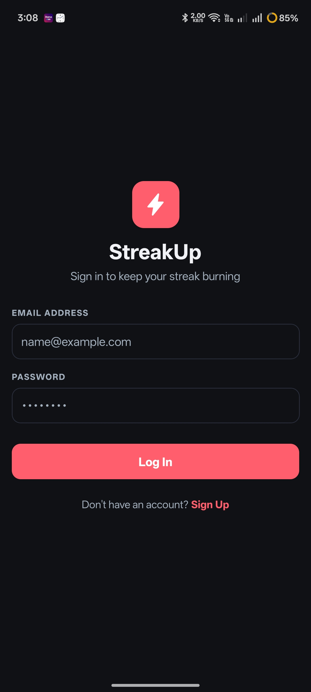
    </td>
    <td align="center" width="33%">
      <strong>Habits & Creation</strong><br/>
      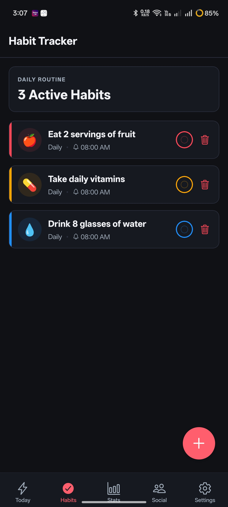
    </td>
    <td align="center" width="33%">
      <strong>Social & Friends</strong><br/>
      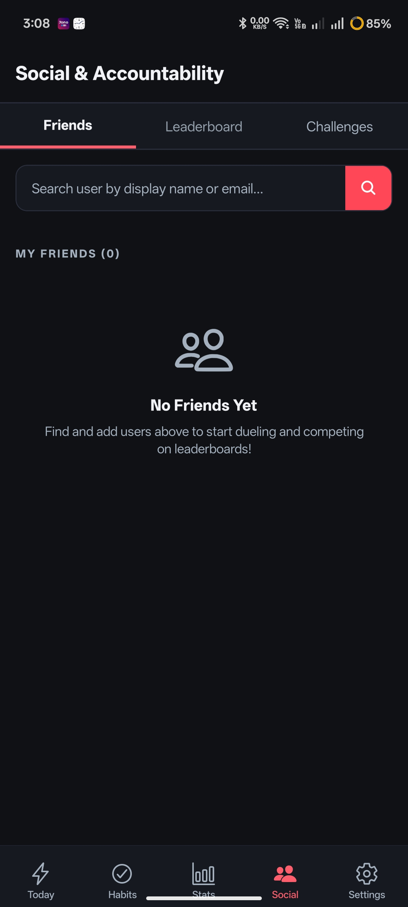
    </td>
  </tr>
  <tr>
    <td align="center" width="33%">
      <strong>Streakboard</strong><br/>
      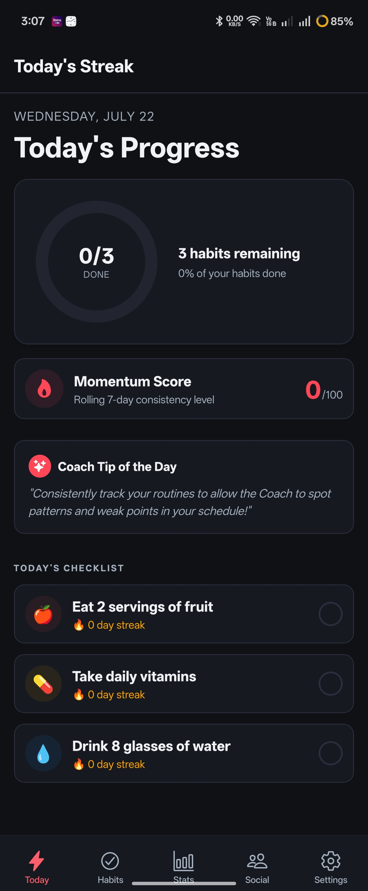
    </td>
    <td align="center" width="33%">
      <strong>Analytics & Stats</strong><br/>
      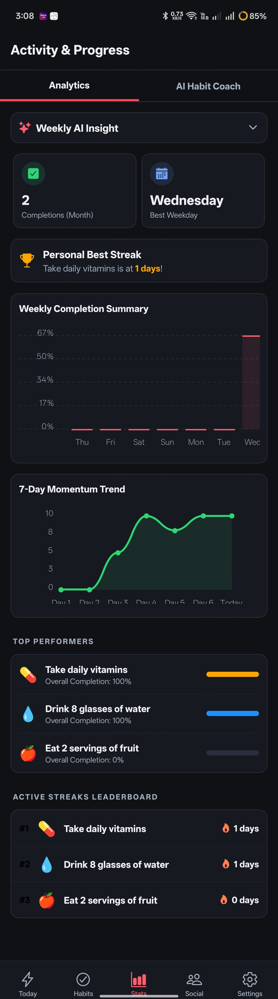
    </td>
    <td align="center" width="33%">
      <strong>Settings & Profile</strong><br/>
      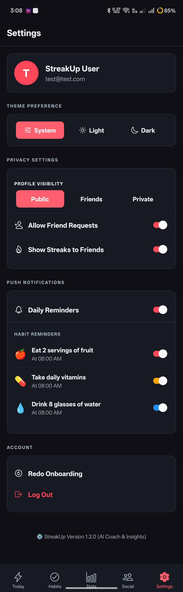
    </td>
  </tr>
</table>

<details open>
  <summary>🎥 Video Walkthrough</summary>
  <br/>
  <p align="center">
    <video src="https://github.com/user-attachments/assets/727aa07f-5810-49ba-8362-761419013a4a" controls width="240" muted autoplay loop></video>
  </p>
</details>

## Tech Stack 

<p align="left">
  
  
  
  
  
  
</p>

---

## App Concept & Features

StreakUp leverages gamification to keep users engaged and motivated:
- **Streak Multipliers**: Build consecutive days of completed habits to multiply your visual status level.
- **Fitness Tracking**: Record workouts (duration, calories, distance) and pair them with active habits.
- **Aesthetic Visualizations**: Dynamic progress charts and rich, custom dark mode styling with glassmorphism touches.
- **Real-time Sync**: Synced securely via Firebase Auth and Firestore with offline-first support.

---

## Navigation Structure

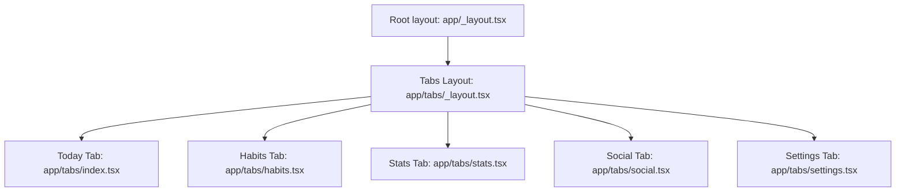

---

## Social Feature Data Flow

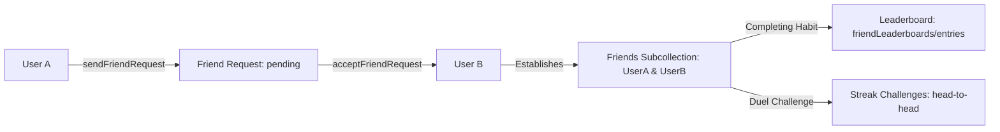

---

## Habits Screen Component Structure

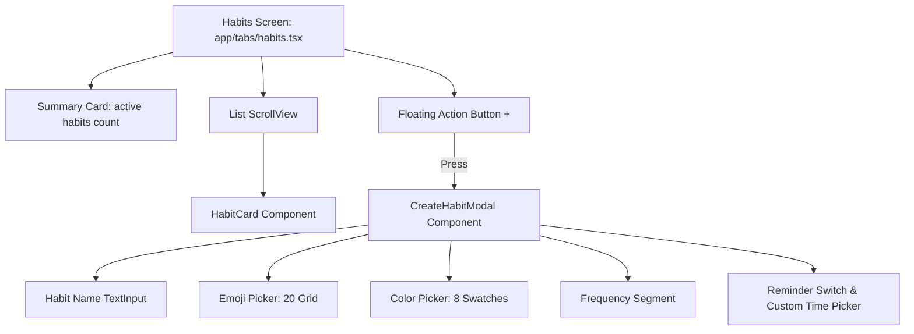

---

## Cloud Firestore Data Model Structure

```mermaid
graph TD
    usersCol[users Collection] --> userDoc[User Document: uid]
    userDoc --> habitsSub[habits Subcollection]
    userDoc --> completionsSub[completions Subcollection]
    userDoc --> friendsSub[friends Subcollection]
    userDoc --> requestsSub[friendRequests Subcollection]
    userDoc --> settingsSub[settings/privacy Document]
    
    habitsSub --> habitDoc[Habit Document: habitId]
    habitDoc --> hId[id: string]
    habitDoc --> hName[name: string]
    habitDoc --> hEmoji[emoji: string]
    habitDoc --> hColor[color: string]
    habitDoc --> hFreq[frequency: string]
    habitDoc --> hRemind[reminderTime: string &#124; null]
    habitDoc --> hCreated[createdAt: string]
    habitDoc --> hStreak[streak: number]
    habitDoc --> hCompletions[completions: string&#91;&#93; -- cached dates]
    habitDoc --> hPublic[isPublic: boolean]
    habitDoc --> hVis[visibility: string]
    
    completionsSub --> compDateDoc[Date Document: YYYY-MM-DD]
    compDateDoc --> habitsSub2[habits Subcollection]
    habitsSub2 --> compHabitDoc[Completed Habit Document: habitId]
    compHabitDoc --> completedAt[completedAt: string]

    friendsSub --> friendDoc[Friend Document: friendUid]
    friendDoc --> fUid[uid: string]
    friendDoc --> fName[displayName: string]
    friendDoc --> fEmail[email: string]
    friendDoc --> fStreak[currentStreak: number]
    
    requestsSub --> reqDoc[Request Document: requestId]
    reqDoc --> rFrom[fromUid: string]
    reqDoc --> rTo[toUid: string]
    reqDoc --> rStatus[status: string]

    rootChallenges[challenges Collection] --> challengeDoc[Challenge Document: challengeId]
    challengeDoc --> cCreator[creatorId: string]
    challengeDoc --> cOpponent[opponentId: string]
    challengeDoc --> cStatus[status: string]
    challengeDoc --> cComps[creatorCompletions / opponentCompletions: string&#91;&#93;]
    
    rootLeaderboards[friendLeaderboards Collection] --> lbHabit[Habit Document: habitName]
    lbHabit --> lbEntries[entries Subcollection]
    lbEntries --> lbEntryDoc[Entry Document: uid]
    lbEntryDoc --> lbStreak[currentStreak: number]
    lbEntryDoc --> lbRate[completionRate: number]
```

---

## Streak Calculation Algorithm Flowchart

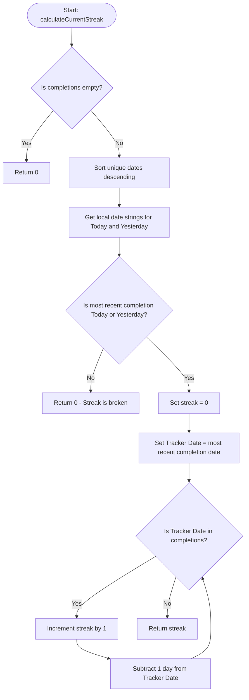

---

## OpenAI API Setup & Cost Estimation

To configure the AI Habit Coach:
1. Obtain an API key from the [OpenAI Platform](https://platform.openai.com/api-keys).
2. Set `EXPO_PUBLIC_OPENAI_API_KEY` in your `.env` file.
3. Model Choices & Costs:
   - **GPT-3.5-turbo (Default)**: Best for speed (1-2s latency) and cost-efficiency. Average cost is ~$0.002 per request. 1,000 active users making 5 requests/day each costs ~$8.00/month.
   - **GPT-4o (Alternative)**: Best for complex behavioral suggestions but carries a higher latency (~3-5s) and higher costs (~$0.06 per request). 1,000 active users making 5 requests/day costs ~$80.00/month.

---

## AI Coach Data Flow Diagram

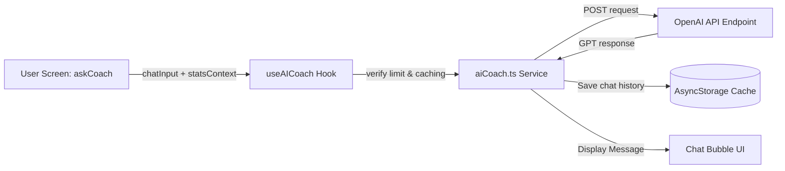

---

## Onboarding Flow Diagram

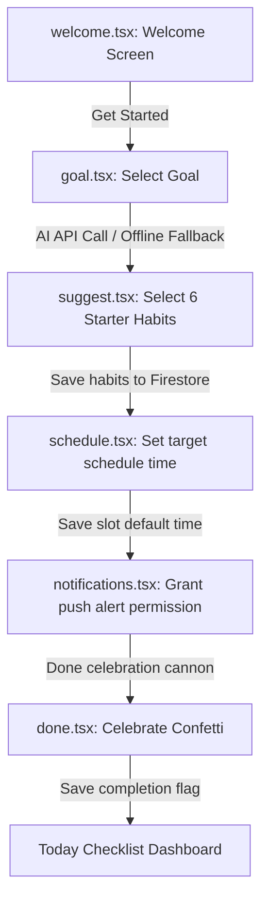

---

## Setup Prerequisites

To run this app locally:
1. **Node.js**: Make sure Node.js (v18+) is installed.
2. **Expo Go**: Install the Expo Go app on your iOS or Android physical device, or set up an emulator.
3. **Firebase Project**:
   - Create a Firebase project in the [Firebase Console](https://console.firebase.google.com/).
   - Enable **Authentication** (Email/Password) and **Cloud Firestore**.
   - Create a Web App configuration to get your Firebase credentials.
4. **Environment Variables**:
   - Copy `.env.example` to `.env` in the root directory.
   - Replace the placeholder credentials with your actual Firebase Web Config values.
5. **React Native Reanimated Setup**:
   - Reanimated is pre-installed. If rebuilding from scratch, ensure `react-native-reanimated/plugin` is configured in your babel plugins array, and clear your bundler cache with `npx expo start --clear` if worklet compilation warnings arise.

### Installation & Launching

```bash
# Install dependencies
npm install

# Start the Expo development server
npm run start
```

---

## Google Play Store Build & Submission

StreakUp is configured for native compilation and deployment using EAS (Expo Application Services). Follow these steps to build and submit your app for the Google Play Store:

### 1. Prerequisites
- Install the EAS CLI globally:
  ```bash
  npm install -g eas-cli
  ```
- Log in to your Expo account:
  ```bash
  eas login
  ```
- Link your local workspace to your EAS project:
  ```bash
  eas project:init
  ```

### 2. Configure Build Profiles (`eas.json`)
The build profiles are configured in [eas.json](file:///d:/projects/StreakUp/eas.json). It defines development, preview (for APK testing), and production (for store submission) build setups.

### 3. Generate Android App Bundle (.aab)
To build a signed production Android App Bundle (`.aab`) for Google Play Store upload, run:
```bash
eas build --platform android --profile production
```
*EAS Build will handle key generation, package signing, and bundle compiling on secure cloud servers, returning a download link to your `.aab` file once complete.*

### 4. Direct Store Submission
If you have a Google Play Developer account and have configured your service account credentials, submit the compiled build directly from the CLI:
```bash
eas submit --platform android
```
Alternatively, download the `.aab` bundle from your Expo dashboard and manually upload it under the **Production** track inside the [Google Play Console](https://play.google.com/console/).
