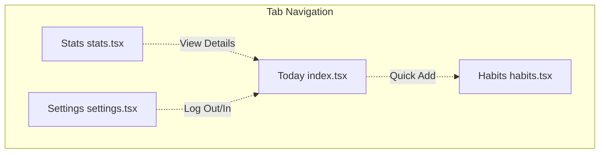

# Screen Tour: StreakUp

This document maps out the placeholder screens and details the layout structure for StreakUp.

---

## Screen Navigation Map

---

## Screen Guidelines

### 1. Today Screen (`app/(tabs)/index.tsx`)
- **Visuals**: Features a formatted date header at the top and a prominent circular **Progress Ring** card. When all tasks are completed, the layout changes to present a trophy icon next to a "Streak Maintained!" celebration card.
- **Content**:
  - *Progress Ring*: Built using circular SVG paths. Shows active ratio (e.g. `2/3 done`) and animate the fill arc using timing transitions.
  - *Today checklist*: List of habits showing title, emoji, current streak count, and custom checkbox.
  - *Confetti Cannon*: Invisible container that spawns full-screen falling colored particles.
- **Animation Behaviors**:
  - *Spring Checkbox*: Tapping a habit or checkbox executes a spring-based scale animation (`withSpring`) that bounces the container size while interpolating the outline/background color to match the habit's accent.
  - *Timing Arc*: Completing or undoing a habit updates the progress value, triggering a 500ms ease timing transition (`withTiming`) that rotates and adjusts the SVG ring offset.
  - *Cannon burst*: Triggered via reference (`confettiRef.current.start()`) when state transitions to 100% complete, throwing 150 floating confetti pieces down the viewport.

### 2. Habits Screen (`app/(tabs)/habits.tsx`)
- **Visuals**: A clean top-header card showing active habits count. Underneath, a scrollable list of individual habit cards.
- **Content**: Displays custom-accented cards, each containing:
  - Emoji symbol badge (colored based on accent color).
  - Habit title.
  - Active schedule frequency and optionally the notification time.
  - Current streak counter fires (e.g., `🔥 5` if active).
  - An interactive checkmark bubble button on the right side.
- **Action**: Clicking the checkmark bubble toggles the daily completion state. Clicking the floating action button (FAB) `+` in the bottom-right corner reveals the **Create Habit Modal**.

### 2a. Create Habit Modal (`components/CreateHabitModal.tsx`)
- **Visuals**: A sleek slide-up modal aligned at the bottom with a dark/light card background.
- **Content**:
  - *Name Input*: Styled single-line entry.
  - *Emoji Grid*: 4x5 selector grid representing 20 active categories.
  - *Color presets*: Row of 8 circular accent choices.
  - *Frequency selector*: Horizontal segment buttons (`Daily`, `Weekdays`, `Weekends`, `Custom`).
  - *Reminder time*: Switch toggle. If enabled, it displays a pure Javascript wheel/card picker representing Hours (1-12), Minutes (00, 15, 30, 45), and AM/PM options.
- **Action**: Pressing "Create" validates the name and appends the habit, while "Cancel" discards changes and slides the modal down.

### 3. Stats Screen (`app/(tabs)/stats.tsx`)
- **Visuals**: Completion analytics charts (weekly bar charts and streak timelines).
- **Content**: Summarized KPIs:
  - *Active Streak*: Current consecutive habit execution days.
  - *Completion Rate*: Overall percentage.
  - *Workout Stats*: Total workout minutes and calories.
  - *Achievements*: Gamification medals unlocked.

### 4. Settings Screen (`app/(tabs)/settings.tsx`)
- **Visuals**: Clean card-based layout lists.
- **Content**:
  - *Profile Section*: User name, email, avatar image.
  - *Theme Toggle*: Swap between System, Light, and Dark modes.
  - *Firebase Integration*: Connection check status.
  - *Developer Settings*: Option to seed mock habits/workouts for testing.

### 5. Habit Detail Screen (`app/habit/[id].tsx`)
- **Visuals**: A dedicated detail view accessed by tapping a habit card body on the Habits dashboard list. Supports full light/dark themes.
- **Content**:
  - *Header*: Features a customized action bar containing a back navigation button, "Details" title, and a red trash/delete button.
  - *Habit Identity*: Large visual layout displaying the habit's emoji, name, frequency, and reminder settings.
  - *Stats Grid*: A three-column grid layout displaying:
    - **Current Streak**: Consecutive completion days with a flame icon.
    - **Longest Streak**: Historical record with a trophy icon.
    - **30-Day Rate**: Consistency percentage calculated for the trailing 30 days.
  - *Calendar Heatmap*: Integrated calendar displaying completions. Each completed day is painted with a solid circle matching the habit's specific accent color. Supports horizontal month swiping.
