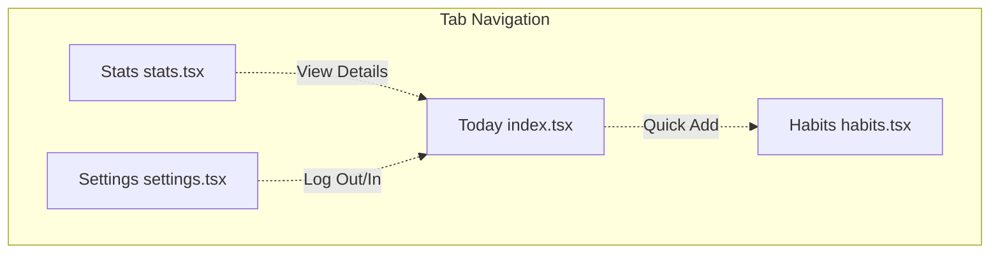

# Screen Tour: StreakUp

This document maps out the placeholder screens and details the layout structure for StreakUp.

---

## Screen Navigation Map

---

## Screen Guidelines

### 1. Today Screen (`app/(tabs)/index.tsx`)
- **Visuals**: Displays current local streak count at the top in a large energetic fire-gradient card.
- **Content**: A vertical list of habits scheduled for today. Complete habits by clicking checkboxes that trigger micro-animations.
- **Action**: Floating action button (FAB) or header button to log quick activities.

### 2. Habits Screen (`app/(tabs)/habits.tsx`)
- **Visuals**: Habits grouped by category card (e.g. Fitness, Mind, Nutrition) using HSL-based border colors.
- **Content**: A total count of habits, list of all habits, and a "Create Habit" entry modal or button.
- **Action**: Long-press or click a habit to view options to edit or delete.

### 3. Stats Screen (`app/(tabs)/stats.tsx`)
- **Visuals**: Completion analytics charts (weekly bar charts and streak timelines).
- **Content**: Summarized KPIs:
  - *Active Streak*: Current consecutive habit execution days.
  - *Completion Rate*: Overall percentage.
  - *Workout Stats*: Total workout minutes and calories.
  - *Achievements*: Gamification medals unlocked.

### 4. Settings Screen (`app/(tabs)/settings.tsx`)
- **Visuals**: Clean card-based layout lists.
- **Content**:
  - *Profile Section*: User name, email, avatar image.
  - *Theme Toggle*: Swap between System, Light, and Dark modes.
  - *Firebase Integration*: Connection check status.
  - *Developer Settings*: Option to seed mock habits/workouts for testing.
