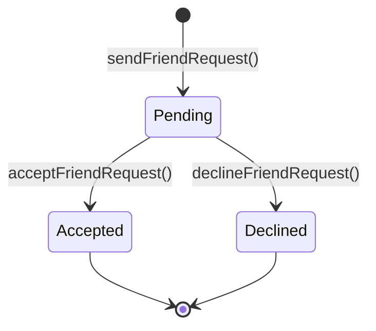
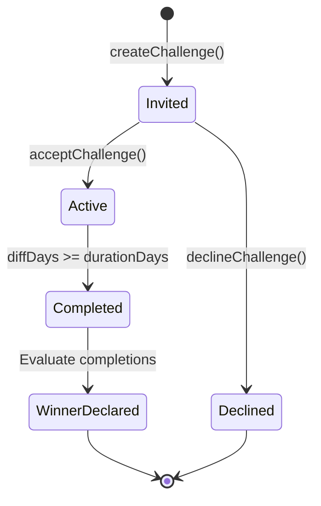

# Social & Accountability Architecture

This document details the data structures, state machines, and design trade-offs chosen to build the Social, Dueling, and Leaderboards subsystems in **StreakUp**.

---

## 1. Social Graph Data Model

StreakUp implements a highly decoupled, bidirectionally written friends graph using subcollections.

### Firestore Paths
- **UserProfile**: `users/{uid}`
- **Friend Connections**: `users/{uid}/friends/{friendUid}`
- **Friend Requests**: `users/{uid}/friendRequests/{requestId}`
- **Streak challenges**: `challenges/{challengeId}`
- **Leaderboards**: `friendLeaderboards/{habitName}/entries/{uid}`

---

## 2. State Machines

### Friend Request Lifecycle


### Challenge Duel Lifecycle


---

## 3. Security Rules Recommendations

To enforce security boundaries, implement the following Firestore Security Rules:

```javascript
rules_version = '2';
service cloud.firestore {
  match /databases/{database}/documents {
    
    // User profile matching
    match /users/{userId} {
      allow read: if request.auth != null;
      allow write: if request.auth != null && request.auth.uid == userId;
      
      // Friends connection boundary
      match /friends/{friendId} {
        allow read, write: if request.auth != null && request.auth.uid == userId;
      }
      
      // Friend requests boundary
      match /friendRequests/{requestId} {
        allow read: if request.auth != null && request.auth.uid == userId;
        // Allow another authenticated user to write a request into this user's inbox
        allow write: if request.auth != null;
      }
    }
    
    // Global challenges collection
    match /challenges/{challengeId} {
      allow read, write: if request.auth != null && 
        (request.auth.uid == resource.data.creatorId || request.auth.uid == resource.data.opponentId || request.data == null);
    }
    
    // Global leaderboards
    match /friendLeaderboards/{habitName}/entries/{uid} {
      allow read: if request.auth != null;
      allow write: if request.auth != null && request.auth.uid == uid;
    }
  }
}
```

---

## 4. Scalability Notes: Denormalization vs. Joins

In relational databases, ranking tables are compiled by executing SQL `JOIN` statements across users, friends, habits, and completion tables. In a NoSQL document database like Firestore, executing dynamic joins at runtime is highly expensive:
- It requires fetching the current user's friends list (N items).
- Issuing separate read commands for each friend's habits subcollection.
- Computing completion percentages on the fly for dozens of users.
- Sorting the items in local memory.

This approach scales at **O(N * H)** in read operations and client CPU cycles, which degrades performance as the number of users grow.

**StreakUp's Solution: Flattened Denormalization**
Every time a user checkmarks a public habit, we calculate their streak and 30-day consistency score immediately on the write phase and record a single flat document under `friendLeaderboards/{habitName}/entries/{uid}`.
When any user opens the Leaderboard screen, they make a single index query sorted by `currentStreak` descending. This runs at **O(1)** complexity for client devices, delivering instant layouts, minimal network traffic, and maximum Firestore read efficiency.
