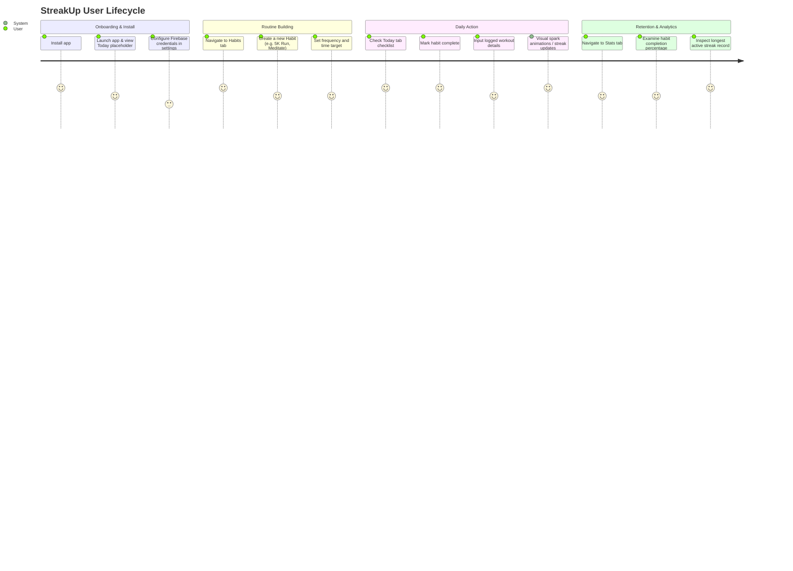

# Walkthrough: StreakUp

This document details the user journey and guides you through the planned features of the StreakUp app.

---

## App Overview & Planned Features (🚧)

StreakUp is designed to be highly interactive and rewarding. Here is a list of features currently under construction:

1. **🔒 Secure Authentication (Auth)**:
   - Email/password register & sign-in.
   - Profile state persistence across app reloads.
2. **🔥 Habit Management & Checking**:
   - Create, edit, and delete habits with flexible frequencies (daily, specific days).
   - Tap-to-complete circular check boxes on the **Today** tab.
3. **🏋️ Workout Logger**:
   - Record duration, type, calories burned, and custom text notes.
   - Sync logs directly into your profile history.
4. **📊 Analytics & Charts**:
   - Visual graph representations showing completion rates, active streak records, and weekly progression.
5. **🌓 Light / Dark Mode Toggle**:
   - Full compatibility with native settings, and manual options inside Settings.

---

## Planned User Journey

This diagram outlines how a user will experience the application, from initial onboarding to regular streak tracking and review.

